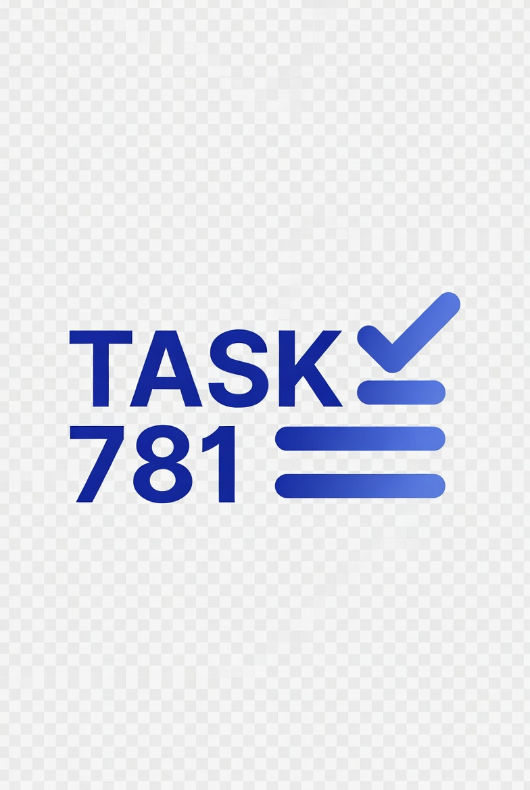

# Task781



**Modern, high-performance task management built with React + TypeScript**

A beautiful, fully functional Kanban board with drag-and-drop, dark mode, inline editing, overdue detection, confetti celebrations, and local persistence.

Built by **Mirza Causevic** as part of his professional portfolio.

---

> **Live Demo:** [Deploying to Vercel soon...](https://task781.vercel.app) *(coming after push)*

---

## ✨ Features

---

## ✨ Features

- **Drag & Drop Kanban** — Move tasks between To Do, In Progress, and Done
- **Inline Editing** — Click any task title to edit it instantly
- **Smart Filters** — Search + priority filtering
- **Overdue Detection** — Automatically highlights overdue tasks in red
- **Confetti on Completion** — Satisfying animation when you finish a task
- **Dark Mode** — Toggle with one click (persists preference)
- **Local Persistence** — All data saved in your browser (no backend needed)
- **Responsive Design** — Works beautifully on desktop and mobile
- **Priority Labels** — Low / Medium / High with color coding
- **Quick Add** — Add tasks with due date and priority in seconds

---

## 🛠 Tech Stack

- **Vite** + **React 18** + **TypeScript**
- **Tailwind CSS**
- **@hello-pangea/dnd** (smooth drag & drop)
- **lucide-react** (icons)
- **canvas-confetti** (celebration effects)

---

## 🚀 Getting Started

### 1. Clone & Install

```bash
git clone https://github.com/YOUR-USERNAME/task781.git
cd task781
npm install
```

### 2. Run Locally

```bash
npm run dev
```

Open [http://localhost:5173](http://localhost:5173) in your browser.

### 3. Build for Production

```bash
npm run build
```

---

## 📦 Deployment to Vercel (Free & Easy)

### Step-by-Step Vercel Deployment Guide

1. **Push your code to GitHub** (see PowerShell guide below)
2. Go to [https://vercel.com](https://vercel.com) and sign in with GitHub
3. Click **"Add New Project"**
4. Select the `task781` (or `cinestat`) repository from the list
5. Vercel will auto-detect it's a Vite project — no changes needed
6. Click **"Deploy"**
7. In ~30–60 seconds, your live site will be available at `https://task781.vercel.app` (or a custom domain you choose)

**Pro Tips:**
- Every push to `main` branch will automatically redeploy
- You can add a custom domain in Vercel settings (free)
- Enable "Preview Deployments" for every PR (great for portfolio)

**After Deploy:**
- Update the live demo link at the top of this README
- Take screenshots of the running app and add them below

---

### PowerShell Guide: Push to GitHub (https://github.com/fknmiz/cinestat)

**Important:** This project is self-contained. You can push it directly to your `cinestat` repo (as the main project) or as a subfolder `/task781`.

#### Recommended: Push as the main project to `cinestat` repo

Open **PowerShell** as Administrator and run these commands one by one:

```powershell
# 1. Navigate to where you unzipped the task781 folder
cd "C:\Users\YOUR_USERNAME\Desktop\task781"   # ← CHANGE THIS PATH to your actual location

# 2. Initialize Git (if not already a repo)
git init

# 3. Add all files
git add .

# 4. First commit
git commit -m "Initial commit: Task781 - Professional Kanban Portfolio Project"

# 5. Rename branch to main (GitHub default)
git branch -M main

# 6. Connect to your existing cinestat repo (or create new if needed)
git remote add origin https://github.com/fknmiz/cinestat.git

# 7. Pull any existing content first (important if repo is not empty)
git pull origin main --allow-unrelated-histories

# 8. Push everything
git push -u origin main
```

**If the repo already has files and you want to keep them:**
- Instead of step 7, create a subfolder: `mkdir task781` then move files, or push to a new branch.

After pushing, go to GitHub → your repo → Settings → Pages (if needed) or just use Vercel.

**Need help with the path?** In PowerShell type `pwd` to see current location, or use File Explorer to right-click the folder → "Open in Terminal".

---

## 📸 Screenshots (Add These After Running the App)

**How to take good screenshots:**
1. Run `npm run dev`
2. Open http://localhost:5173
3. Use Windows Snipping Tool or ShareX (free) for clean captures
4. Take 4–5 screenshots:
   - Full dashboard (light + dark mode)
   - Drag & drop in action
   - Task editing modal/state
   - Confetti animation (harder — use video or describe)
   - Mobile responsive view

**Recommended screenshots to add:**


*(Create a `screenshots/` folder in the repo and upload your images)*

---

## 📸 Screenshots

*(Add your own screenshots here after deploying)*

- Main dashboard with 3-column Kanban
- Dark mode active
- Task being dragged
- Confetti animation on completion

---

## 🎯 Why This Project?

This project demonstrates:

- Modern React patterns (hooks, state management, TypeScript)
- Professional UI/UX with Tailwind
- Real-world features (drag & drop, persistence, animations)
- Clean, maintainable code structure
- Attention to detail (overdue logic, editing UX, responsive design)

Perfect for showcasing **Front-End Development** skills in a portfolio.

---

## 🔮 Future Improvements (Ideas)

- [ ] Add user authentication (Firebase / Supabase)
- [ ] Team collaboration features
- [ ] Task subtasks & checklists
- [ ] Calendar view integration
- [ ] Export to CSV / PDF
- [ ] Keyboard shortcuts

---

## 📄 License

MIT License — feel free to use and modify.

---

**Built with ❤️ by Mirza Causevic**  
[LinkedIn](https://linkedin.com/in/mirzacaus) • [GitHub](https://github.com/YOUR-USERNAME)

---

*This project is part of Mirza Causevic's Professional Skillset Portfolio*
